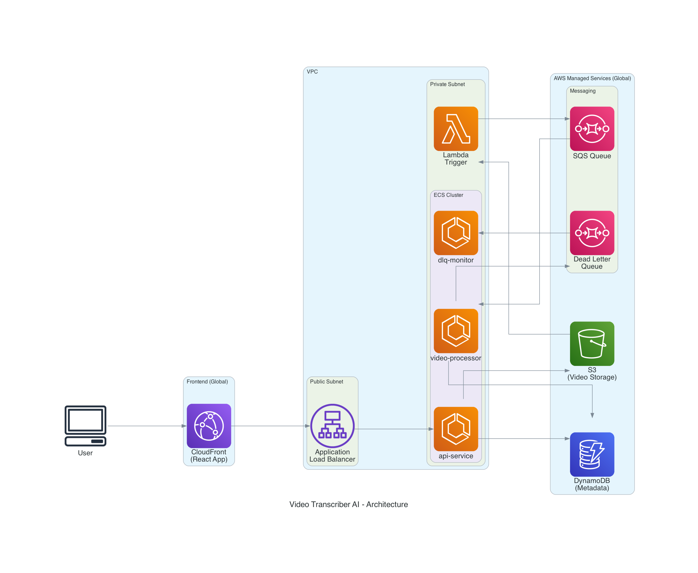

# Video Transcriber AI

A full-stack cloud-native video transcription and analysis application with AI-powered features, built on AWS cloud architecture.



## Overview

This is a production-ready, scalable video transcription system that leverages AWS managed services and modern cloud architecture patterns. The application provides automatic video transcription using Whisper and AI-generated summary.

## Architecture

The application is built using **AWS Cloud Architecture** with the following components:

### Frontend Layer

- **CloudFront** (Global): Content delivery network for React application
- **React Application**: Modern web interface with responsive design

### Application Layer (VPC - Public Subnet)

- **Application Load Balancer**: Traffic distribution and SSL termination
- **API Service (ECS)**: FastAPI backend for API endpoints

### Processing Layer (VPC - Private Subnet)

- **Lambda Trigger**: S3 event-driven video processing initiation
- **Video Processor (ECS)**: Whisper-based transcription service with SQS integration
- **DLQ Monitor (ECS)**: Dead Letter Queue monitoring and retry logic

### Data & Messaging Layer

- **S3**: Video storage and processed transcript storage
- **DynamoDB**: Video metadata and processing status
- **SQS**: Message queue for asynchronous video processing
- **Dead Letter Queue**: Failed message handling and retry mechanism

### Infrastructure Management

- **Terraform**: Infrastructure as Code for AWS resource provisioning
- **Docker**: Containerization for all services

## Project Structure

```
video-transcriber-ai/
├── client/                          # Frontend React Application
│   ├── src/
│   │   ├── components/             # React components
│   │   │   ├── VideoUpload.tsx     # Drag & drop upload
│   │   │   ├── VideoList.tsx       # Video library
│   │   │   ├── VideoDetail.tsx     # Video player & transcript
│   │   │   └── VideoProcess.tsx    # Processing status
│   │   ├── contexts/               # React contexts (Auth)
│   │   ├── services/               # API integration services
│   │   ├── types/                  # TypeScript definitions
│   │   └── layouts/                # Page layouts & auth flows
│   ├── public/                     # Static assets
│   ├── Dockerfile                  # Container configuration
│   └── package.json                # Dependencies
│
├── server/                          # Backend Python Application
│   ├── app/
│   │   ├── api/v1/                 # API endpoints
│   │   │   ├── videos.py           # Video CRUD operations
│   │   │   ├── auth.py             # Authentication
│   │   │   └── config.py           # Configuration endpoints
│   │   ├── core/                   # Core functionality
│   │   │   ├── config.py           # Settings management
│   │   │   ├── cognito_auth.py     # AWS Cognito integration
│   │   │   └── dependencies.py     # FastAPI dependencies
│   │   ├── services/               # Business logic
│   │   │   ├── video_service.py    # Video processing
│   │   │   ├── audio_processor.py  # Audio extraction
│   │   │   ├── summary_generator.py # AI summaries
│   │   │   ├── cache_service.py    # ElastiCache integration
│   │   │   ├── sqs_client.py       # SQS operations
│   │   │   └── text_compressor.py  # Transcript compression
│   │   ├── lambda/                 # Lambda functions
│   │   │   └── s3_trigger_handler.py # S3 event processing
│   │   ├── worker/                 # Background workers
│   │   │   ├── video_processor/    # Video processing worker
│   │   │   └── dlq_monitor/        # DLQ monitoring worker
│   │   ├── repositories/           # Data access layer
│   │   └── schemas/                # Pydantic models
│   ├── Dockerfile.api              # API service container
│   ├── Dockerfile.video-processor  # Video processor container
│   ├── Dockerfile.dlq              # DLQ monitor container
│   ├── Dockerfile.lambda           # Lambda deployment package
│   └── requirements.txt            # Python dependencies
│
├── terraform/                       # Infrastructure as Code
│   ├── main.tf                     # Main configuration
│   ├── s3.tf                       # S3 bucket configuration
│   ├── dynamodb.tf                 # DynamoDB tables
│   ├── sqs.tf                      # SQS queues
│   ├── lambda.tf                   # Lambda functions
│   ├── cognito.tf                  # User authentication
│   ├── elasticache.tf              # Memcached cluster
│   ├── secrets_manager.tf          # Secrets storage
│   ├── ssm_parameters.tf           # Configuration parameters
│   └── outputs.tf                  # Output values
│
├── docker-compose.yml              # Local development setup
└── README.md                       # This file
```

## Features

### 🔐 Authentication & Security

- AWS Cognito user authentication
- Email verification and password recovery

### 🎥 Video Management

- Drag & drop video upload with progress tracking
- S3-based storage with presigned URL generation

### 🤖 AI-Powered Transcription & Analysis

- Automatic transcription using Whisper
- AI-generated content summaries (GPT-4)

### ⚡ High Performance & Scalability

- Asynchronous video processing with SQS
- Dead Letter Queue for failed job retry
- Horizontal scaling with ECS
- CloudFront CDN for global content delivery

### 🎨 Modern UI/UX

- Responsive design with Tailwind CSS
- Glass morphism effects and gradient animations
- Real-time processing status updates
- Professional enterprise-grade interface

## Technology Stack

### Frontend

- **Framework**: React 18 + TypeScript
- **Build Tool**: Vite
- **Styling**: Tailwind CSS

### Backend

- **Framework**: FastAPI (Python 3.12)
- **Authentication**: AWS Cognito + python-jose
- **AI/ML**:
  - OpenAI Whisper (transcription)
  - OpenAI GPT-4 (summaries & Q&A)
  - Sentence Transformers (text embedding)
- **Audio Processing**: NumPy, FFmpeg
- **Async**: Uvicorn ASGI server

### AWS Services

- **Compute**: ECS Fargate, Lambda
- **Storage**: S3
- **Database**: DynamoDB
- **Cache**: ElastiCache (Memcached)
- **Messaging**: SQS
- **Authentication**: Cognito
- **CDN**: CloudFront
- **Load Balancer**: Application Load Balancer
- **Secrets**: Secrets Manager, Systems Manager Parameter Store

### Infrastructure

- **IaC**: Terraform
- **Containers**: Docker, Docker Compose
- **Orchestration**: Amazon ECS

---

**Built with ☁️ AWS Cloud Architecture**
